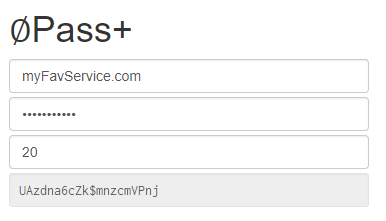

# NullPass+
Infinite complex passwords for all your sites and accounts, just remembering one master password. Off-line: no information transmitted anywhere. Mobile support.

>One password = infinite secure passwords

If you don't want to host this app yourself you can simply visit: **[www.jasoft.org/nullpass/](http://www.jasoft.org/nullpass/)** to use it immediately.

## What is this for?

**NullPass+** is a password manager that **doesn't require you to keep you passwords stored anywhere**, and that allows you to have a different complex password for every site or system you use. 

This is accomplished by combining **a single master password** with a site specific token (often domain name or your email address) to generate a unique password. This password is **cryptographically secure** and your **original password is safe and not recoverable** should an attacker manage to obtain your unique site password. This means an attack on one of the sites you visit will not disclose your password to any other services - keeping your accounts safe.

It uses no Internet connection and doesn't save your passwords anywhere.

If you access it from a **mobile device**, you can choose to pin it to your Home Screen in iOS or Android and you'll get a ready to use app that will work off-line, even if there's no connection to the Internet.

## Usage
Just enter a domain, email account or other unique resource you want to protect with a password, your unique secure password, the desired length for the password (12 by default), and you're done!

Some advise:

- Try to use a long, non obvious master password or [pass-phrase](https://en.wikipedia.org/wiki/Passphrase). A pass-phrase would be even better since they are long, difficult to guess or break by brute force, and easy to remember. This is your key to all your passwords from now on so, keep it secure and don't forget it!.
- Use the complete first-level domain name if you're going to use just one account, or the combination of domain name + username if you're using several accounts. For example, if you want to protect your unique Facebook account with NullPass+ use `facebook.com` as the "domain" parameter. However if you're protecting your GMail account you should use `youraccount@gmail.com` as the "domain" parameter since you can protect several GMail accounts with this system. In that way each one will have its own password and will be easy to get from NullPass+.
- Since you're not going to remember any of those generated passwords, use long ones. NullPass+ suggests 12 as the default length, but I typically use 20 or 30 characters long passwords. Try to use the same length always since changing the length changes the whole generated password, not only the "extra" characters you drop-in.
- Make a list of the services protected with NullPass+. You can use a simple .txt file saved to your favorite cloud drive (Dropbox, GDrive, pCloud...). Keep there a list of domains used, the user names and the length of the chosen password. In this way you'l always know exactly how to generate the password again if needed. Although it only contains domain names and lengths and an attacker would not be able to derive any passwords from it it's better to store this list in an encrypted storage.

## Derived code & enhancements
This project derived from the original code by **Adam MacLeod** on [Github](https://github.com/adammacleod/nullpass).

I've upgraded the app with the following enhancements:

- **Support for working off-line**. Once you visit the NullPass+ default page once, it can work without any Internet connection. This is specially useful if you plan to use it from a mobile device.
- **Ensure a symbol is always included**: since a lot of accounts require you to include some symbol in your passwords and the original algorithm didn't ensure that, I've added a simple way to ensure that a symbol is always used in the password. The character in the middle of the generated password is deterministically substituted by a symbol that changes depending on the Unicode code for the character that is substituted.
- **Support for app "pinning"** under iOS, Android, Windows Phone, Windows 10... You can just add the app to your home screen in any of these operating systems and you get a nice icon to access it anytime as if it were a native app. It will be shown as a nice icon and open directly.
- **Better support for copying the generated password on mobile devices**: the original code made difficult to copy the resulting password from a mobile device. Now you can copy it without any problems + I've made the field read only. Now if you click on it or make it get the focus, the password gets automatically copied to your clipboard (this is very useful in mobile devices, where copying from a disables field is not always very easy).
- **Basic validation**: if you try to generate a password shorter than 6 characters it will default to 6 (less than that makes no sense). If the length is more than 88 it will change automatically to 88 (the length of the SHA-512 hash string encoded in Base64).
